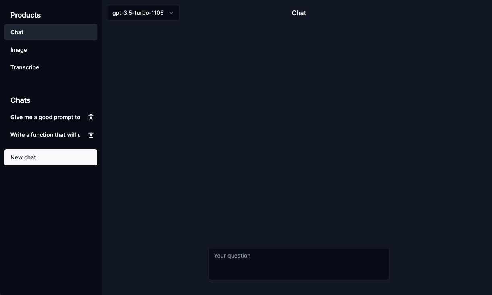
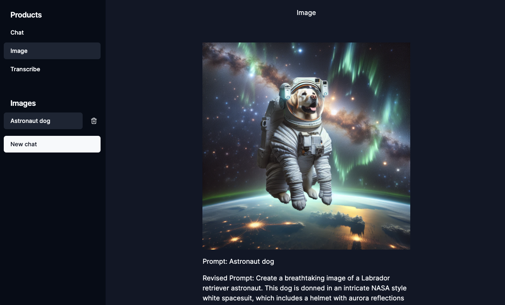
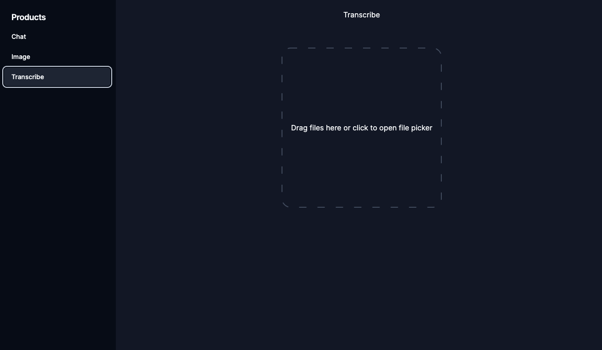

# AI Dashboard

This is an AI dashboard that I created for myself. It's hosted at [ai.esezen.me](ai.esezen.me). You can play with it if you bring your own Open AI API key.
The keys are stored at localStorage and not shared with any other service than Open AI itself. At the moment there are 3 things you can do:

## Chat

The normal ChatGPT like interface. Let's you use GPT4




## Image

Prompt to image



## Transcribe
Audio file to text. I thought this might be useful for converting voice memos to notes



## How to run locally

If you are reading this, you probably know how to run this locally, but in case you don't, it's
First, run the development server:

```bash
npm run dev
# or
pnpm dev
```

Open [http://localhost:3000](http://localhost:3000) with your browser to see the result.

## Thing I'm planning to do

- Clean up the code
  - The reducer logic is especially bad
- Authentication using Supabase
- Save things to an actual database
  - I currently same images to localStorage which hits the quota after a few images
- Maybe move the Open AI calls to a Lambda. (Vercel doesn't allow functions to run longer than 10 seconds on free tier)
- Connect to a locally running modal (Ollama)
- Import / export from localStorage
- Stable diffusion support for images
- Upload PDF
- Upload image
